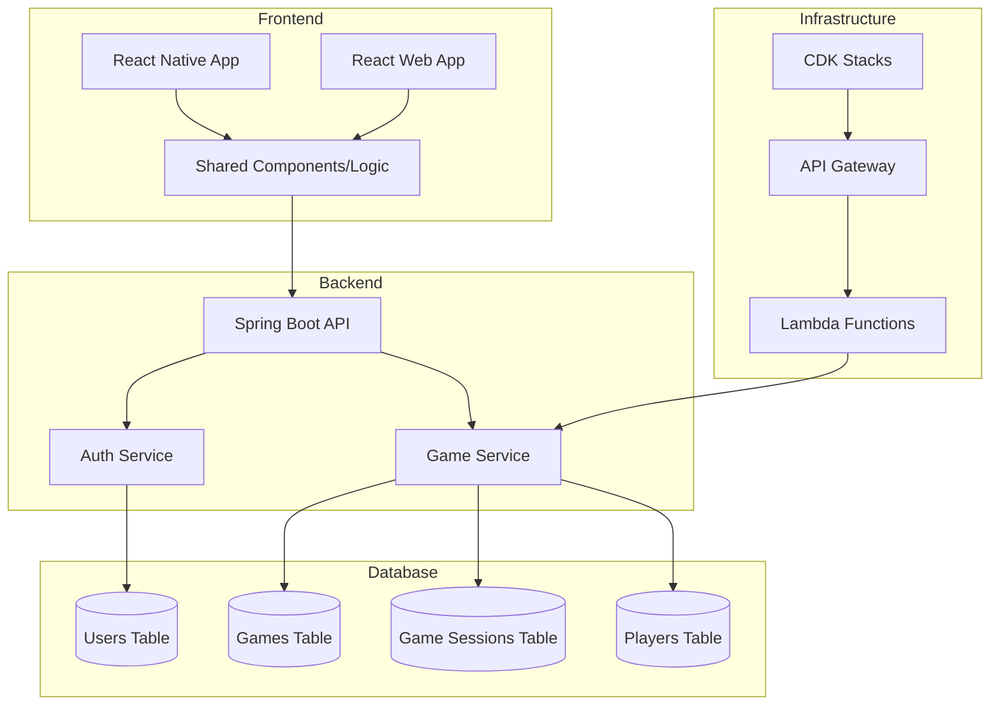

# 151 Card Game Architecture

## System Overview



## Project Structure

```
game151/
├── frontend/           # Frontend monorepo
│   ├── web/           # Next.js web application
│   ├── native/        # React Native mobile app
│   └── package.json   # Monorepo configuration
├── backend/           # Spring Boot backend
├── infrastructure/    # AWS CDK infrastructure
└── shared/           # Shared code/components
```

## Database Schema

### Users Table
```typescript
interface User {
  userId: string;          // Partition Key
  username: string;        // Unique
  email: string;         // Unique
  passwordHash: string;
  createdAt: number;
  lastLogin: number;
  stats: {
    gamesPlayed: number;
    gamesWon: number;
    totalScore: number;
  }
}
```

### Games Table
```typescript
interface Game {
  gameId: string;         // Partition Key
  status: GameStatus;     // WAITING, IN_PROGRESS, FINISHED
  createdAt: number;      // Sort Key
  startedAt?: number;
  endedAt?: number;
  maxPlayers: number;
  currentRound: number;
  settings: {
    timeLimit: number;
    scoreLimit: number;
    allowSpectators: boolean;
  }
}
```

### Game Sessions Table
```typescript
interface GameSession {
  sessionId: string;      // Partition Key
  gameId: string;         // GSI
  timestamp: number;      // Sort Key
  action: GameAction;     // DEAL, PLAY, DRAW, etc.
  playerId: string;
  data: any;             // Action-specific data
}
```

### Players Table
```typescript
interface Player {
  playerId: string;      // Partition Key
  gameId: string;        // GSI
  userId: string;        // GSI
  position: number;      // Sort Key
  status: PlayerStatus;  // ACTIVE, LEFT, SPECTATOR
  hand: string[];        // Card IDs
  score: number;
  joinedAt: number;
}
```

## Frontend Architecture

### Shared Components
- Card components
- Game board
- Player avatars
- Score display
- Chat system
- Game controls

### React Native Specific
- Navigation
- Touch controls
- Native animations
- Push notifications

### React Web Specific
- Responsive design
- Keyboard controls
- WebSocket fallback
- Browser storage

## Backend Architecture (Java/Spring)

### Core Services
1. Game Service
   - Game state management
   - Turn handling
   - Score calculation
   - Game rules engine

2. Auth Service
   - User authentication
   - Session management
   - JWT handling

3. WebSocket Service
   - Real-time game updates
   - Player presence
   - Chat functionality

### Dependency Injection (Guice)
```java
@Module
public class GameModule extends AbstractModule {
    @Override
    protected void configure() {
        bind(GameService.class).to(GameServiceImpl.class);
        bind(GameRepository.class).to(DynamoDBGameRepository.class);
        bind(WebSocketService.class).to(WebSocketServiceImpl.class);
    }
}
```

## Infrastructure (CDK)

### Stacks
1. Database Stack
   - DynamoDB tables
   - GSIs
   - Backup configurations

2. API Stack
   - API Gateway
   - Lambda functions
   - WebSocket API

3. Auth Stack
   - Cognito User Pool
   - IAM roles
   - Security groups

4. Monitoring Stack
   - CloudWatch metrics
   - Alarms
   - Log groups

## Build System

### Frontend
- TypeScript
- React Native CLI
- Webpack (web)
- Metro (native)
- NativeWind/TailwindCSS

### Backend
- Java 17
- Maven/Gradle
- Spring Boot
- Guice

### Infrastructure
- CDK
- TypeScript
- AWS SAM (for Lambda) 